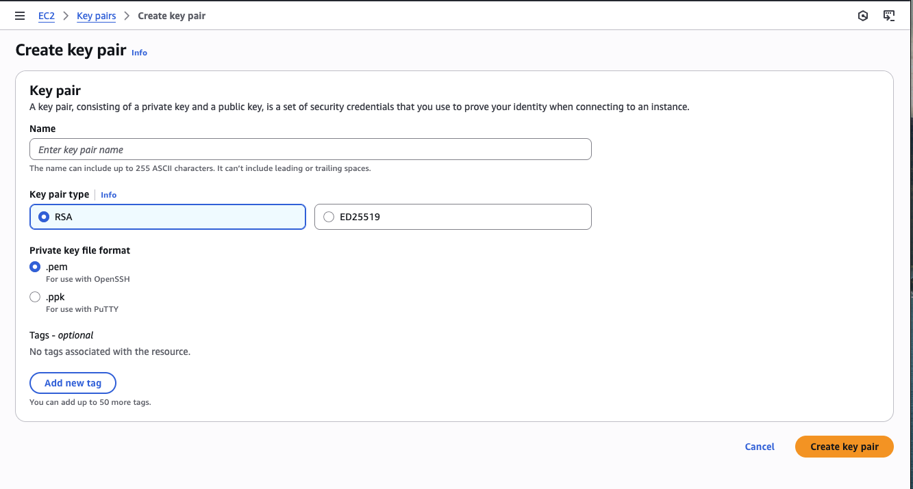

# HIPAA/NIST Compliant Genetic Analysis Infrastructure

This Terraform configuration deploys a comprehensive, compliance-ready AWS infrastructure for genetic analysis workloads, meeting HIPAA, NIH-GDS, GINA, and NIST SP 800-171 requirements.

All development is done on a Mac. You may need to change conmmands depending on your operating system.


## Quick start

1. Install the AWS CLI
   ```bash
   brew install aws
   aws configure
   # enter in ACCESS_KEY_ID and SECRET_ACCESS_KEY from AWS console
   # if you don't know how to do that, ChatGPT can help
   ```

2. Create an EC2 key pair in the AWS console (ssh_key_name)


3. Configure variables for your environment:
   ```bash
   # copy + edit terraform.tfvars with your values
   cp terraform.tfvars.example terraform.tfvars
   
   # create database_password and update terraform.tfvars with it
   openssl rand -base64 32

   # create application_secret and update terraform.tfvars with it
   openssl rand -base64 32
   ```

4. Deploy infrastructure:
   ```bash
   terraform fmt                    # makes it pretty
   terraform init                   # connects to your provider (AWS)
   terraform plan -out=plan.tfplan  # creates and saves the plan
   terraform apply                  # deploys infra

   # take down infra
   terraform destroy                # takes down infra
   ```

5. Access EC2 instances to run software on them (for your genome):
   ```bash
   # via Session Manager (recommended, more compliant)
   aws ssm start-session --target <instance-id>
   
   # via Bastion Host (traditional)
   ssh -i ~/.ssh/<key>.pem ubuntu@<bastion-ip>
   ```


### Cost estimation
- monthly cost: $200-400 (upper bound if running 24x7, maybe even more)
- major components: EC2 instances, NAT Gateway, CloudWatch logs, compliance services
- cost optimization: Spot instances, S3 lifecycle policies, log retention

### Resources
- total resources: 110
- VPC endpoints: 10 (complete private connectivity)
- S3 buckets: 4 (FASTQ, logs, CloudTrail, Config)
- KMS keys: 4 (dedicated encryption per service)
- Config rules: 5 (continuous compliance monitoring)
- security services: 6 (GuardDuty, Inspector, Macie, Security Hub, WAF, Backup)


###  Files
- `main.tf`: main entry point with locals and documentation
- `variables.tf`: input variables and validation
- `providers.tf`: AWS provider configuration
- `terraform.tfvars.example`: configuration template
- `README.md`: this documentation
- `components/networking.tf`: VPC, subnets, routing, NAT Gateway, VPC endpoints
- `components/storage.tf`: S3 buckets (FASTQ, logs, CloudTrail, Config), EFS file system
- `components/security.tf`: security groups, KMS keys, encryption policies
- `components/compute.tf`: EC2 instances, AMI selection, user data scripts
- `components/iam.tf`: IAM roles, policies, instance profiles
- `components/monitoring.tf`: CloudWatch logs, alarms, SNS topics, budgets
- `components/compliance.tf`: GuardDuty, Inspector, Config, Macie, Security Hub, Backup
- `components/outputs.tf`: output values and resource information


## Compliance for HIPAA, NIH-GDS, GINA, and NIST SP 800-171

### Data protection
- encryption at rest: all S3 buckets, EBS volumes, EFS encrypted with KMS
- encryption in transit: TLS enforcement, VPC endpoints for private connectivity
- immutable logs: object lock on audit logs (365 days) and access logs (90 days)
- access logging: complete S3 access audit trail

### Security
- GuardDuty: Threat detection and monitoring
- Inspector: Vulnerability assessments for EC2, ECR, Lambda
- Macie: Data discovery and PII protection
- Security Hub: Centralized security findings with CIS and PCI standards
- WAF: Web application firewall protection

### Network security
- private connectivity: 10 VPC interface endpoints for AWS services
- isolated compute: private subnets with NAT Gateway
- IMDSv2: instance metadata service hardening
- Session manager: secure access without SSH keys

### Monitoring
- CloudTrail: multi-region audit logging with log validation
- Config rules: 5 automated compliance checks
- VPC flow logs: complete network traffic monitoring
- Backup: automated daily backups with lifecycle management


## Post-deployment checklist
- [ ] configure DNS validation for ACM certificate
- [ ] test Session Manager access
- [ ] configure SNS topic subscriptions for monitoring
- [ ] run initial Inspector and Macie scans
- [ ] review and customize Config rules
- [ ] test backup restoration procedures


## Compliance links
- AWS compliance programs: https://aws.amazon.com/compliance/
- HIPAA on AWS: https://aws.amazon.com/compliance/hipaa-compliance/
- NIST SP 800-171: https://csrc.nist.gov/publications/detail/sp/800-171/rev-2/final
- NIH-GDS policy: https://gds.nih.gov/

---

Note: This configuration provides enterprise-grade security and compliance. Please review with your organization's compliance team and legal counsel to ensure it meets all specific requirements for your use case.

## Disclaimer

This software is provided "as is" without warranty of any kind, express or implied, including but not limited to the warranties of merchantability, fitness for a particular purpose, and noninfringement. In no event shall the authors or copyright holders be liable for any claim, damages, or other liability, whether in an action of contract, tort, or otherwise, arising from, out of, or in connection with the software or the use or other dealings in the software.

Use at your own risk. The authors assume no responsibility for any damages, data loss, or compliance issues that may arise from the use of this configuration. Always test in a non-production environment first and consult with qualified professionals before deploying to production. 